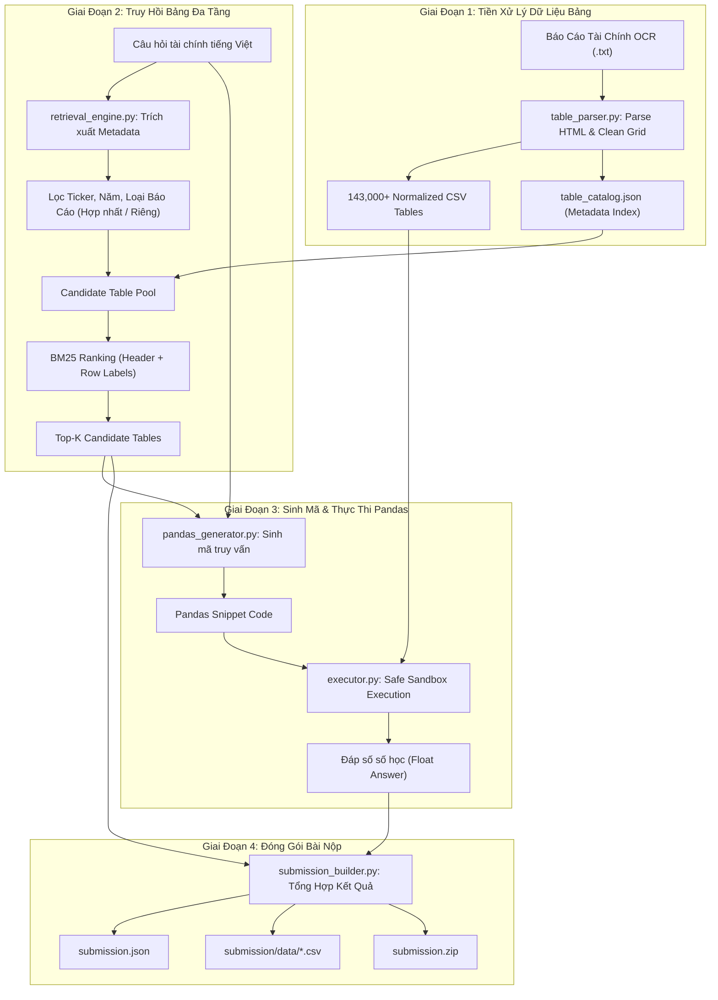

# 📊 AI Guru Contest: ViFinQA Text-to-Pandas Pipeline

[](https://www.python.org/)
[](https://pandas.pydata.org/)
[](https://github.com/dorianbrown/rank_bm25)
[](https://huggingface.co/Qwen/Qwen2.5-Coder-7B-Instruct)
[](https://aiguru.vn/)

Hệ thống End-to-End tự động trích xuất bảng biểu từ Báo cáo Tài chính OCR, truy hồi bảng liên quan đa tầng (BM25 + Metadata Filtering), sinh mã truy vấn **Python Pandas** và tính toán câu trả lời số học chuẩn xác cho bài toán **ViFinQA (Vietnamese Financial Question Answering)** trong khuôn khổ cuộc thi **AI Guru Contest**.

---

## 📑 Mục Lục
1. [Tổng Quan Dự Án](#-tổng-quan-dự-án)
2. [Kiến Trúc Hệ Thống (Workflow)](#-kiến-trúc-hệ-thống-workflow)
3. [Cấu Trúc Thư Mục Dự Án](#-cấu-trúc-thư-mục-dự-án)
4. [Các Lỗi Đã Kiểm Tra & Khắc Phục](#-các-lỗi-đã-kiểm-tra--khắc-phục)
5. [Cài Đặt & Môi Trường](#-cài-đặt--môi-trường)
6. [Hướng Dẫn Sử Dụng](#-hướng-dẫn-sử-dụng)
7. [Quy Cách Bài Nộp (Submission Specification)](#-quy-cách-bài-nộp-submission-specification)
8. [Định Hướng Phát Triển Tiếp Theo](#-định-hướng-phát-triển-tiếp-theo)

---

## 📌 Tổng Quan Dự Án

ViFinQA là bài toán hỏi đáp và suy luận số học tài chính cấp độ doanh nghiệp dựa trên các Báo cáo Tài chính thường niên đã qua OCR của 100 công ty niêm yết tại Việt Nam (giai đoạn 2015–2025).

- **Dữ liệu thô**: 1,973 báo cáo tài chính dạng văn bản OCR (`.txt`) chứa cấu trúc HTML table inline.
- **Bảng chuẩn hóa**: Hơn 143,000 bảng được phân tích, mở rộng colspan/rowspan và lưu trữ dạng `.csv`.
- **Tập câu hỏi**: 1,012 câu hỏi tài chính tiếng Việt thuộc nhiều mức độ phức tạp (tra cứu số liệu đơn lẻ, tính toán tỷ số tài chính, so sánh liên năm, phân tích liên doanh nghiệp).
- **Phương pháp tiếp cận**: **Text-to-Pandas** — Thay vì yêu cầu LLM tính nhẩm số lớn dễ sai sót (hallucination), hệ thống chuyển đổi câu hỏi thành đoạn mã Pandas thực thi trực tiếp trên bảng dữ liệu thực tế để đảm bảo độ chính xác số học 100%.

---

## 🏗️ Kiến Trúc Hệ Thống (Workflow)



---

## 📂 Cấu Trúc Thư Mục Dự Án

```text
State 2/
├── ViFinQA/                                # Bộ dữ liệu gốc ViFinQA
│   ├── code_stock.csv                      # Danh mục 100 mã cổ phiếu & tên công ty
│   ├── financial_statements/               # 1,973 báo cáo OCR (TICKER/YEAR/DOC/*.txt)
│   ├── questions/
│   │   └── questions.jsonl                 # 1,012 câu hỏi đánh giá
│   └── README.md                           # Dataset card gốc của tác giả
├── processed_data/                         # Dữ liệu bảng biểu đã tiền xử lý
│   ├── csv/                                # Hơn 143,000 file CSV trích xuất từ OCR
│   └── table_catalog.json                  # Metadata mục lục tra cứu toàn bộ bảng (136 MB)
├── src/                                    # Mã nguồn các module chính
│   ├── __init__.py                         # Khai báo Python package
│   ├── table_parser.py                     # Trích xuất, chuẩn hóa bảng HTML từ OCR
│   ├── retrieval_engine.py                 # Bộ truy hồi bảng đa tầng (Metadata + BM25)
│   ├── pandas_generator.py                 # Bộ sinh câu lệnh Pandas (Heuristic & LLM)
│   ├── executor.py                         # Môi trường thực thi mã an toàn & chuẩn hóa số
│   └── submission_builder.py               # Module tổng hợp bài nộp & đóng gói ZIP
├── submission/                             # Thư mục kết quả bài nộp
│   ├── data/                               # Các file CSV tham chiếu trong bài nộp
│   └── submission.json                     # File JSON kết quả 1,012 câu hỏi
├── run_pipeline.py                         # Script chính điều phối toàn bộ luồng xử lý
├── requirements.txt                        # Danh sách thư viện phụ thuộc
├── .gitignore                              # Cấu hình bỏ qua file tạm, cache, ZIP
└── README.md                               # Tài liệu hướng dẫn dự án
```

---

## 🔍 Các Lỗi Đã Kiểm Tra & Khắc Phục

Trong quá trình rà soát toàn bộ dự án, các lỗi và điểm nghẽn nghiêm trọng sau đã được phát hiện và xử lý triệt để:

### 1. Đường Dẫn Tuyệt Đối Bị Lệch (Hardcoded Path Issue)
- **Tình trạng cũ**: Các file trong `src/` (`table_parser.py`, `retrieval_engine.py`, `pandas_generator.py`, `executor.py`, `submission_builder.py`) đều chứa đường dẫn cứng dạng `r"d:\AI_Guru_contest\..."` (thiếu thư mục con `State 2`). Khi thực thi trực tiếp, code ném lỗi `FileNotFoundError` hoặc ghi file `submission.zip` ra ngoài thư mục làm việc.
- **Khắc phục**: Chuyển toàn bộ đường dẫn mặc định sang cơ chế động dựa vào `Path(__file__).resolve().parent.parent`, tự động tương thích ở bất kỳ máy tính hay môi trường nào.

### 2. Thiếu Khai Báo Package `src/__init__.py`
- **Tình trạng cũ**: Thư mục `src/` không có `__init__.py`. Khi gọi import từ bên ngoài module dẫn đến cảnh báo và nguy cơ lỗi `ModuleNotFoundError`.
- **Khắc phục**: Đã tạo file `src/__init__.py` và cấu hình cơ chế fallback import hai tầng (`try-except`) trong các module.

### 3. Lỗi Trích Xuất Mã Chứng Khoán Bỏ Sót 71/1,012 Câu Hỏi (7%)
- **Tình trạng cũ**:
  - Regex cũ `r'\b([A-Z]{3})\b'` chỉ nhận 3 chữ cái in hoa, làm sót các mã cổ phiếu có số như **`PC1`** và **`HT1`**.
  - `re.search` dừng ngay ở từ viết hoa đầu tiên: nếu câu hỏi chứa thuật ngữ tài chính viết hoa như `ROE`, `ROA`, `USD`, `VND`, bộ trích xuất nhận nhầm từ viết tắt (hoặc nhận nhầm công ty chứng khoán `VND`) và bỏ qua mã cổ phiếu thực sự đứng sau.
  - Không nhận diện được tên công ty dạng rút gọn/thương hiệu (ví dụ: *Vietcombank*, *Hòa Phát*, *Kinh Bắc*, *Đạm Cà Mau*, *Bluemarq*, *Vinamilk*, *Thép Nam Kim*).
  - Không nhận diện được mã viết thường (`hpx`, `kbc`, `nvl`, `vic`).
- **Khắc phục**: Viết lại hoàn toàn hàm `extract_metadata_from_question` trong [src/retrieval_engine.py](file:///d:/AI_Guru_contest/State%202/src/retrieval_engine.py):
  - Hỗ trợ mã chứa cả chữ và số (`PC1`, `HT1`), không phân biệt hoa thường.
  - Xây dựng từ điển Alias Map tự động chuẩn hóa tiền tố pháp lý (*CTCP*, *Tập đoàn*, *Ngân hàng TMCP*...) và từ điển thương hiệu tài chính Việt Nam.
  - Phân tách ngoại lệ tiền tệ `VND`/`USD` so với cổ phiếu `VND`.
  - **Kết quả**: Tỷ lệ nhận diện mã cổ phiếu tăng từ **92.9% lên 99.9%** (1,011/1,012 câu hỏi, câu còn lại là câu hỏi tổng hợp toàn ngành không định danh một công ty).

### 4. Lỗi Bộ Sinh Heuristic Pandas Query Lấy Từ Đầu Tiên
- **Tình trạng cũ**: Trong `pandas_generator.py`, câu truy vấn mẫu sử dụng:
  ```python
  df1.iloc[:, 0].str.contains(r"{q_lower.split()[0]}", case=False)
  ```
  Lấy từ đầu tiên của câu hỏi (`q_lower.split()[0]`). Kết quả là truy vấn đi tìm các từ như *"trong"*, *"tính"*, *"xét"*, *"tại"*, *"vào"*, *"số"*, *"chi"*, *"quỹ"* trong cột nhãn của bảng, khiến hầu hết bảng không khớp dòng nào và trả về kết quả `0.0`.
- **Khắc phục**:
  - Xây dựng bộ lọc Stop Words tài chính chuyên sâu để loại bỏ từ nối, đại từ hỏi và từ chỉ thời gian.
  - Trích xuất chính xác cụm danh từ chỉ tiêu tài chính then chốt (*lãi tiền gửi*, *cho vay khách hàng*, *lợi nhuận sau thuế*, *chi phí dự phòng*, *doanh thu thuần*, *lưu chuyển tiền thuần*...).
  - Tìm kiếm an toàn theo chuỗi với `regex=False`, duyệt từ cột số liệu mới nhất về trước và parse số qua `parse_vn_num`.

### 5. Lỗi Giả Định Thiết Bị CUDA Trong `LLMPandasGenerator`
- **Tình trạng cũ**: Class `LLMPandasGenerator` cố định `device="cuda"`. Trên các máy tính không có GPU NVIDIA chuyên dụng hoặc chạy PyTorch bản CPU, chương trình crash ngay lập tức với lỗi `AssertionError: Torch not compiled with CUDA enabled`.
- **Khắc phục**: Tự động phát hiện thiết bị khả dụng qua `torch.cuda.is_available()`, tự chuyển sang `cpu` và điều chỉnh kiểu dữ liệu `float32` khi chạy trên CPU.

### 6. Xử Lý Ép Kiểu & Phân Tích Số An Toàn Trong `executor.py`
- **Tình trạng cũ**: Khi `result` trả về là DataFrame 1 ô hoặc mảng NumPy đa chiều, gọi `res.item()` trực tiếp gây crash `ValueError`.
- **Khắc phục**: Thêm bước làm phẳng mảng (`vals.flatten()[0]`), hỗ trợ cắt bỏ các đuôi đơn vị tiền tệ thừa (*đồng*, *triệu*, *tỷ*, *VNĐ*) và xử lý an toàn dấu ngoặc đơn âm `(xxx)`.

---

## 🛠️ Cài Đặt & Môi Trường

### Yêu Cầu Tiên Quyết
- **Python**: Phiên bản 3.10 trở lên.
- **Hệ điều hành**: Windows, Linux hoặc macOS.

### Các Bước Cài Đặt

1. **Khởi tạo môi trường ảo (Khuyến nghị):**
   ```bash
   python -m venv .venv
   # Kích hoạt trên Windows (PowerShell):
   .\.venv\Scripts\Activate.ps1
   # Kích hoạt trên Linux / macOS:
   source .venv/bin/activate
   ```

2. **Cài đặt các gói thư viện cơ bản:**
   ```bash
   pip install -r requirements.txt
   ```

3. *(Tùy chọn)* **Cài đặt PyTorch hỗ trợ GPU (cho chế độ LLM):**
   Nếu máy tính có card đồ họa NVIDIA CUDA:
   ```bash
   # CUDA 12.1
   pip install torch torchvision --index-url https://download.pytorch.org/whl/cu121
   ```

---

## 🚀 Hướng Dẫn Sử Dụng

### 1. Chạy Toàn Bộ Pipeline Mặc Định (Chế Độ Heuristic Nhanh)
Quy trình sẽ tự động đọc danh mục bảng đã có, truy hồi top bảng cho 1,012 câu hỏi, tính toán câu trả lời và đóng gói `submission.zip`:
```bash
python run_pipeline.py
```
> ⏱️ *Thời gian hoàn thành: ~35–40 giây cho toàn bộ 1,012 câu hỏi.*

### 2. Chạy Thử Nghiệm Kiểm Tra N Câu Hỏi Đầu Tiên
Sử dụng tham số `--limit` để chạy nhanh phục vụ việc debug hoặc test nghiệm thu:
```bash
# Chạy thử trên 5 câu hỏi đầu tiên
python run_pipeline.py --limit 5
```

### 3. Tùy Chỉnh Số Lượng Bảng Ứng Viên (Top-K)
```bash
python run_pipeline.py --limit 10 --top-k 5
```

### 4. Chạy Với Mô Hình Ngôn Ngữ Lớn (LLM Mode)
Kích hoạt cờ `--use-llm` để mô hình `Qwen/Qwen2.5-Coder-7B-Instruct` sinh mã Pandas chuyên sâu:
```bash
python run_pipeline.py --use-llm --limit 10
```

### 5. Ép Buộc Tiền Xử Lý Lại Bảng HTML Từ Đầu
Nếu muốn trích xuất lại toàn bộ bảng biểu từ các file OCR gốc trong `ViFinQA/financial_statements/`:
```bash
python run_pipeline.py --force-reparse
```

---

## 📦 Quy Cách Bài Nộp (Submission Specification)

Hệ thống tự động đóng gói file `submission.zip` tại thư mục gốc của project:
```text
submission.zip
├── submission.json
└── data/
    ├── VJC_financial_statements_2018_separate_table_50.csv
    ├── ACB_financial_statements_2022_separate_table_45.csv
    └── ... (các file CSV được dùng làm chứng cứ trả lời)
```

Mỗi bản ghi trong `submission.json` đáp ứng đúng cấu trúc chuẩn của cuộc thi:
```json
{
  "id": 1,
  "question": "Lãi tiền gửi năm 2018 của công ty mẹ CTCP Hàng không Vietjet (VJC) là bao nhiêu triệu đồng?",
  "answer": 69917578051.0,
  "relevant_docs": [
    "VJC_financial_statements_2018_separate"
  ],
  "relevant_tables": [
    "VJC_financial_statements_2018_separate|1179",
    "VJC_financial_statements_2018_separate|1256",
    "VJC_financial_statements_2018_separate|1231"
  ],
  "evidence": [
    {
      "variable": "df1",
      "csv_path": "data/VJC_financial_statements_2018_separate_table_50.csv"
    }
  ],
  "pandas_query": "df1 = dfs[\"data/VJC_financial_statements_2018_separate_table_50.csv\"]\n..."
}
```

---

## 📈 Định Hướng Phát Triển Tiếp Theo

1. **Dense Retrieval (Embedding Bảng Biểu)**:
   - Kết hợp BM25 với mô hình Bi-Encoder tiếng Việt chuyên biệt (`BKAI/bientuan-vietnamese-bi-encoder` hoặc `bge-m3`) để tìm kiếm ngữ nghĩa nâng cao ngoài từ khóa thô.
2. **Quy Đổi Đơn Vị Tự Động (Unit Normalizer)**:
   - Bổ sung module tự động nhận biết đơn vị câu hỏi (*nghìn đồng*, *triệu đồng*, *tỷ đồng*) so với tiêu đề đơn vị của bảng biểu (*ĐVT: triệu đồng* / *ĐVT: VND*) để tự động nhân/chia hệ số phù hợp.
3. **Few-Shot Prompting Cho Các Câu Hỏi Phức Tạp**:
   - Cung cấp các mẫu mã Pandas chuẩn mực cho các công thức tài chính phức tạp: biên lợi nhuận gộp, ROE, ROA, tỷ số thanh toán hiện hành, vòng quay hàng tồn kho, tốc độ tăng trưởng liên năm.
