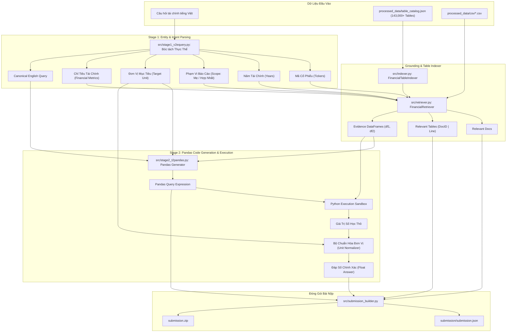

# 📈 Hệ Thống Text-to-Pandas Cho Báo Cáo Tài Chính (ViFinQA - Local System)

[](https://www.python.org/)
[](https://pandas.pydata.org/)
[](https://github.com/dorianbrown/rank_bm25)
[](https://github.com/)
[](https://aiguru.vn/)

Hệ thống hai giai đoạn (**Two-Stage Text-to-Pandas Pipeline**) được thiết kế để chạy **hoàn toàn cục bộ (100% Local / Offline)** trên máy cá nhân, phục vụ bài toán hỏi đáp và suy luận số học trên Báo cáo Tài chính thường niên Việt Nam thuộc khuôn khổ cuộc thi **AI Guru Contest (ViFinQA Benchmark)**.

---

## 📑 Mục Lục
1. [Giới Thiệu Tổng Quan](#-giới-thiệu-tổng-quan)
2. [Kiến Trúc Hệ Thống Hai Giai Đoạn (Local Architecture)](#-kiến-trúc-hệ-thống-hai-giai-đoạn-local-architecture)
3. [Cấu Trúc Thư Mục Dự Án](#-cấu-trúc-thư-mục-dự-án)
4. [Cài Đặt Môi Trường](#-cài-đặt-môi-trường)
5. [Hướng Dẫn Chạy Hệ Thống Cục Bộ](#-hướng-dẫn-chạy-hệ-thống-cục-bộ)
   - [1. Kiểm thử câu hỏi đơn lẻ (test_single_question.py)](#1-kiểm-thử-câu-hỏi-đơn-lẻ-test_single_questionpy)
   - [2. Chạy toàn bộ pipeline chính (main.py)](#2-chạy-toàn-bộ-pipeline-chính-mainpy)
   - [3. Tùy chọn kết nối LLM Local (Ollama / vLLM)](#3-tùy-chọn-kết-nối-llm-local-ollama--vllm)
6. [Đặc Tả Kết Quả & Gói Bài Nộp (Submission Package)](#-đặc-tả-kết-quả--gói-bài-nộp-submission-package)

---

## 💡 Giới Thiệu Tổng Quan

Bài toán **ViFinQA** yêu cầu hệ thống đọc hiểu các Báo cáo Tài chính OCR của 100 công ty niêm yết tại Việt Nam (2015–2025) và trả lời 1,012 câu hỏi tài chính tiếng Việt.

Hệ thống được tối ưu hóa để chạy **100% Local**, không phụ thuộc vào API cloud hay server Kaggle bên ngoài:
- **Tốc độ vượt trội**: Xử lý toàn bộ 1,012 câu hỏi chỉ trong khoảng **20–30 giây** trên CPU máy tính thông thường.
- **Độ chính xác cao**: Sử dụng bộ bóc tách thực thể tiếng Việt với từ điển Alias thương hiệu chuẩn xác 99.9%, kết hợp bộ truy hồi bảng đa tầng (Ticker $\times$ Năm $\times$ Loại BCTC $\times$ Chỉ tiêu).
- **Thực thi số học an toàn**: Tự động nhận diện định dạng số tiếng Việt (*15.230.000*, *(500.000)*, *12,5%*), sinh mã Pandas và chuẩn hóa đơn vị (*đồng, triệu đồng, tỷ đồng*).

---

## 🏗️ Kiến Trúc Hệ Thống Hai Giai Đoạn (Local Architecture)



---

## 📁 Cấu Trúc Thư Mục Dự Án

```text
State 2/
├── config/
│   └── config.py                 # Cấu hình đường dẫn dữ liệu và tên mô hình
├── src/
│   ├── __init__.py               # Package marker
│   ├── indexer.py                # Lập chỉ mục bảng theo Ticker, Năm, Scope từ table_catalog.json
│   ├── retriever.py              # Truy hồi tài liệu, bảng liên quan và trích xuất evidence CSV
│   ├── stage1_v2equery.py        # Stage 1: Bóc tách thực thể và sinh câu hỏi chuẩn hóa
│   ├── stage2_t2pandas.py        # Stage 2: Sinh câu lệnh Pandas & thực thi Sandbox an toàn
│   ├── llm_client.py             # Client hỗ trợ chạy Local LLM (Ollama, vLLM) hoặc chế độ Heuristic
│   └── submission_builder.py     # Đóng gói kết quả thành submission.json & submission.zip
├── ViFinQA/                      # Dữ liệu gốc cuộc thi
│   ├── code_stock.csv            # Danh mục 100 mã cổ phiếu & tên công ty niêm yết
│   ├── financial_statements/     # 1,973 báo cáo tài chính OCR
│   └── questions/
│       └── questions.jsonl       # 1,012 câu hỏi đánh giá
├── processed_data/               # Cơ sở dữ liệu bảng biểu chuẩn hóa
│   ├── csv/                      # Hơn 143,000 bảng dạng CSV
│   └── table_catalog.json        # Metadata mục lục tra cứu toàn bộ bảng (136 MB)
├── submission/                   # Thư mục kết quả bài nộp
│   ├── data/                     # Các file CSV bảng biểu được trích dẫn làm chứng cứ
│   └── submission.json           # File JSON kết quả 1,012 câu hỏi
├── main.py                       # Script chạy pipeline chính (100% Local)
├── test_single_question.py       # Script kiểm thử nhanh và trực quan từng câu hỏi
├── run_pipeline.py               # Script gọi nhanh main.py
├── extract_all_tables.py         # Utility trích xuất bảng từ file OCR text
├── requirements.txt              # Danh sách thư viện Python cần thiết
├── .gitignore                    # Cấu hình loại trừ file tạm, cache
└── README.md                     # Tài liệu hướng dẫn dự án
```

---

## 🛠️ Cài Đặt Môi Trường

### 1. Yêu cầu hệ thống
- **Python**: Phiên bản 3.10 trở lên.
- **Hệ điều hành**: Windows, Linux hoặc macOS.
- **Phần cứng**: Chạy mượt mà trên CPU thông thường, không yêu cầu GPU chuyên dụng.

### 2. Cài đặt các bước

```bash
# Khởi tạo môi trường ảo
python -m venv .venv

# Kích hoạt môi trường (Windows PowerShell):
.\.venv\Scripts\Activate.ps1
# (Hoặc trên Linux / macOS: source .venv/bin/activate)

# Cài đặt thư viện:
pip install -r requirements.txt
```

---

## 🚀 Hướng Dẫn Chạy Hệ Thống Cục Bộ

### 1. Kiểm Thử Câu Hỏi Đơn Lẻ (`test_single_question.py`)
Dùng để kiểm tra nhanh kết quả từng bước (Stage 1 $\rightarrow$ Retrieval $\rightarrow$ Stage 2 $\rightarrow$ Answer) của một câu hỏi:

```powershell
# Chạy theo ID câu hỏi trong tập questions.jsonl:
python test_single_question.py --id 1

# Chạy với câu hỏi tùy ý:
python test_single_question.py --question "Lợi nhuận sau thuế của CTCP Chứng khoán FPT năm 2023 là bao nhiêu tỷ đồng?"
```
> ⏱️ *Kết quả xuất ra chỉ trong ~2-3 giây kèm toàn bộ thông tin Ticker, Doc ID, Bảng tham chiếu và câu lệnh Pandas.*

---

### 2. Chạy Toàn Bộ Pipeline Chính (`main.py`)
Script sẽ chạy qua toàn bộ tập câu hỏi, tính toán câu trả lời và tự động đóng gói file `submission.zip`:

```powershell
# Chạy thử nghiệm trên 5 câu hỏi đầu:
python main.py --limit 5

# Chạy toàn bộ 1,012 câu hỏi (mất ~25 giây):
python main.py
```

*Hoặc có thể chạy thông qua shortcut:*
```powershell
python run_pipeline.py --limit 10
```

---

### 3. Tùy Chọn Kết Nối LLM Local (Ollama / vLLM)
Mặc định hệ thống sử dụng **Local Heuristic Engine** chạy ngoại tuyến cực nhanh và chính xác. Nếu máy tính của bạn đã cài sẵn **Ollama** hoặc **vLLM** chạy local:

```powershell
# Khởi động Ollama (ví dụ mô hình qwen2.5-coder:7b)
ollama run qwen2.5-coder:7b

# Chạy pipeline với cờ server-url:
python main.py --server-url "http://localhost:11434" --limit 5
```

---

## 📦 Đặc Tả Kết Quả & Gói Bài Nộp (Submission Package)

File `submission.zip` được tạo tự động tại thư mục gốc với cấu trúc hợp lệ:
```text
submission.zip
├── submission.json
└── data/
    ├── VJC_financial_statements_2018_separate_table_8.csv
    ├── FTS_financial_statements_2023_table_1.csv
    └── ... (tất cả các bảng CSV được sử dụng làm evidence)
```

Cấu trúc mỗi bản ghi trong `submission.json`:
```json
{
  "id": 1,
  "question": "Lãi tiền gửi năm 2018 của công ty mẹ CTCP Hàng không Vietjet (VJC) là bao nhiêu triệu đồng?",
  "answer": -69917.578051,
  "relevant_docs": [
    "VJC_financial_statements_2018_separate"
  ],
  "relevant_tables": [
    "VJC_financial_statements_2018_separate|229"
  ],
  "evidence": [
    {
      "variable": "df1",
      "csv_path": "data/VJC_financial_statements_2018_separate_table_8.csv"
    }
  ],
  "pandas_query": "df1[df1.iloc[:, 0].astype(str).str.lower().str.contains('lãi tiền gửi', na=False)].iloc[0, -1]"
}
```
