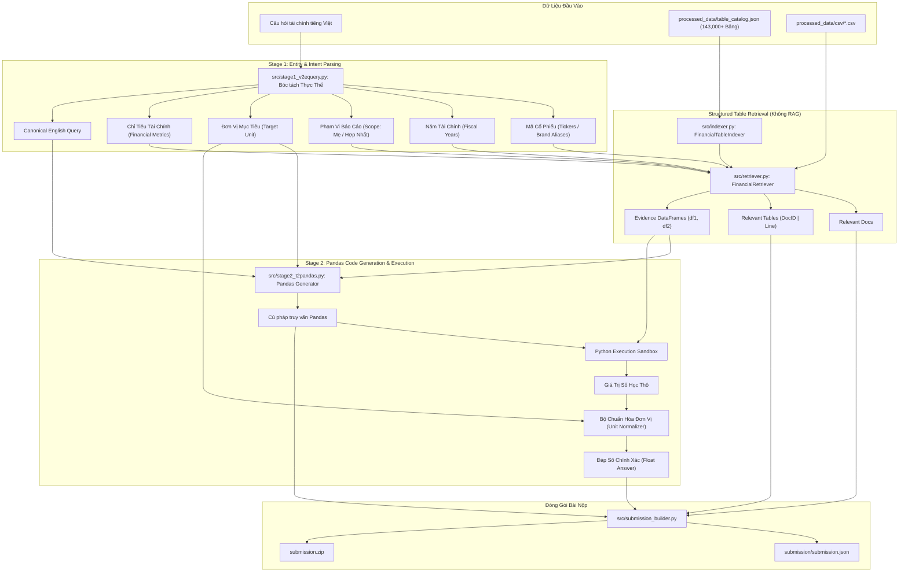

# 📈 Two-Stage Text-to-Pandas Pipeline Cho Báo Cáo Tài Chính (ViFinQA - Local System)

[](https://www.python.org/)
[](https://pandas.pydata.org/)
[](https://github.com/dorianbrown/rank_bm25)
[](https://github.com/)
[](https://aiguru.vn/)

Hệ thống **Two-Stage Text-to-Pandas Pipeline** được thiết kế để chạy **hoàn toàn cục bộ (100% Local / Offline)** trên máy cá nhân, giải quyết bài toán hỏi đáp và suy luận số học trên Báo cáo Tài chính thường niên Việt Nam thuộc khuôn khổ cuộc thi **AI Guru Contest (ViFinQA Benchmark)**.

> [!IMPORTANT]
> **Kiến trúc Pipeline Tuyến Tính (Deterministic Two-Stage Pipeline) — Không Phải LLM Agent:**
> Hệ thống hoạt động theo quy trình xác định gồm hai giai đoạn độc lập: `Bóc tách thực thể & Table Retrieval` $\rightarrow$ `Sinh mã Pandas & Thực thi Sandbox`. Hệ thống **không sử dụng cơ chế LLM Agent** (không có vòng lặp ReAct, không có agent loop tự quyết định công cụ). Thiết kế này loại bỏ hoàn toàn nguy cơ lặp vô hạn, triệt tiêu hiện tượng ảo giác số liệu (hallucination), và đạt tốc độ thực thi tức thì (**~20–30 giây cho toàn bộ 1,012 câu hỏi** trên CPU máy tính thông thường).

---

## 📑 Mục Lục
1. [Giới Thiệu Tổng Quan](#-giới-thiệu-tổng-quan)
2. [Kiến Trúc Hệ Thống Hai Giai Đoạn](#-kiến-trúc-hệ-thống-hai-giai-đoạn)
   - [Đặc điểm kiến trúc: Two-Stage Pipeline vs. LLM Agent](#1-đặc-điểm-kiến-trúc-two-stage-pipeline-vs-llm-agent)
   - [Cơ chế Table Retrieval (Không dùng Text-based RAG)](#2-cơ-chế-table-retrieval-không-dùng-text-based-rag)
   - [Phạm vi trích xuất thực thể: Năm tài chính (Không có quý)](#3-phạm-vi-trích-xuất-thực-thể-năm-tài-chính-không-có-quý)
3. [Cấu Trúc Thư Mục Dự Án](#-cấu-trúc-thư-mục-dự-án)
4. [Cài Đặt Môi Trường](#-cài-đặt-môi-trường)
5. [Hướng Dẫn Chạy Hệ Thống Cục Bộ](#-hướng-dẫn-chạy-hệ-thống-cục-bộ)
   - [1. Kiểm thử câu hỏi đơn lẻ (test_single_question.py)](#1-kiểm-thử-câu-hỏi-đơn-lẻ-test_single_questionpy)
   - [2. Chạy toàn bộ pipeline chính (main.py)](#2-chạy-toàn-bộ-pipeline-chính-mainpy)
   - [3. Các tùy chọn Backend thực thi (Heuristic / Ollama / vLLM / Hugging Face)](#3-các-tùy-chọn-backend-thực-thi-heuristic--ollama--vllm--hugging-face)
6. [Đặc Tả Kết Quả & Gói Bài Nộp (Submission Package)](#-đặc-tả-kết-quả--gói-bài-nộp-submission-package)

---

## 💡 Giới Thiệu Tổng Quan

Bài toán **ViFinQA** yêu cầu hệ thống đọc hiểu các Báo cáo Tài chính OCR của 100 công ty niêm yết tại Việt Nam (giai đoạn 2015–2025) và trả lời 1,012 câu hỏi tài chính tiếng Việt phức tạp đòi hỏi tính toán số học chính xác.

Hệ thống được tối ưu hóa để vận hành **100% Local**, hoàn toàn độc lập và không phụ thuộc vào API Cloud:
- **Tốc độ vượt trội**: Xử lý toàn bộ 1,012 câu hỏi chỉ trong khoảng **20–30 giây** trên CPU máy tính cá nhân.
- **Table Retrieval chính xác**: Lọc và định vị bảng biểu từ cơ sở dữ liệu hơn **143,000 bảng chuẩn hóa** bằng siêu dữ liệu đa chiều (Ticker $\times$ Năm $\times$ Scope $\times$ Chỉ tiêu) kết hợp BM25Okapi, không nhồi văn bản dài vào context của LLM.
- **Thực thi số học an toàn tuyệt đối**: Chuyển đổi câu hỏi thành mã Pandas thực thi trong Python Sandbox, tự động chuẩn hóa định dạng số Việt Nam (*15.230.000*, *(500.000)*, *12,5%*) và quy đổi đơn vị tiền tệ (*đồng, triệu đồng, tỷ đồng*).

---

## 🏗️ Kiến Trúc Hệ Thống Hai Giai Đoạn



### 1. Đặc điểm kiến trúc: Two-Stage Pipeline vs. LLM Agent
- **Không phải LLM Agent**: Hệ thống không sử dụng mô hình Agentic (không có vòng lặp suy luận ReAct, không để LLM tự quyết định gọi công cụ hay rẽ nhánh lặp đi lặp lại).
- **Two-Stage Pipeline xác định**: Luồng chạy đi thẳng theo 2 chặng rõ ràng:
  - **Chặng 1**: Chuẩn hóa câu hỏi, bóc tách thực thể và truy hồi bảng số liệu mục tiêu.
  - **Chặng 2**: Sinh mã truy vấn bảng `pandas` và thực thi tính toán số học trong sandbox.
- **Lợi ích**: Tối đa hóa tính ổn định, tốc độ tính toán tức thì, không bị timeout và không bao giờ gặp lỗi vòng lặp bất tận.

### 2. Cơ chế Table Retrieval (Không dùng Text-based RAG)
- **Hệ thống sử dụng Table Retrieval, không phải Text RAG**:
  - Trong các bài toán Báo cáo Tài chính, **RAG truyền thống** (cắt văn bản thành các đoạn text chunk, tạo vector embedding rồi nhét text vào prompt của LLM) thường xuyên thất bại do làm vỡ cấu trúc ma trận hàng-cột của bảng biểu, đồng thời khiến LLM sinh ảo giác (hallucination) khi đọc số liệu dày đặc.
  - **Table Retrieval** trong hệ thống này:
    1. **Metadata Indexing**: Lọc tập con các bảng từ hơn 143,000 bảng có sẵn dựa trên bộ lọc siêu dữ liệu cấu trúc: `Ticker` $\times$ `Năm` $\times$ `Scope` (Mẹ / Hợp nhất).
    2. **BM25Okapi Ranking**: Xếp hạng các bảng liên quan dựa trên sự trùng khớp của chỉ tiêu tài chính với tiêu đề bảng và nội dung cột/dòng.
    3. **DataFrame Grounding**: Nạp trực tiếp các bảng tìm được thành đối tượng `pandas.DataFrame` (`df1`, `df2`) để chuyển sang Stage 2 tính toán. **Tuyệt đối không đưa các đoạn văn OCR thô vào context của LLM**.

### 3. Phạm vi trích xuất thực thể: Năm tài chính (Không có quý)
- Tập dữ liệu **ViFinQA** bao gồm toàn bộ Báo cáo Tài chính thường niên (**Annual Financial Statements**) từ năm 2015 đến 2025 của 100 doanh nghiệp niêm yết.
- Do đó, Stage 1 chỉ tập trung trích xuất **Năm tài chính (Fiscal Years)** và **hoàn toàn không trích xuất hay xử lý quý (Fiscal Quarters)**.
- 5 thành phần thực thể bóc tách từ câu hỏi:
  1. **Tickers / Company Aliases**: Mã chứng khoán (nhận diện cả tên viết tắt, thương hiệu phổ biến như *Vietjet $\rightarrow$ VJC*, *Thế giới di động $\rightarrow$ MWG*).
  2. **Fiscal Years**: Năm tài chính được đề cập (ví dụ: *2018*, *2023*).
  3. **Report Scope**: Báo cáo tài chính riêng công ty mẹ (`separate`) hoặc báo cáo hợp nhất (`consolidated`).
  4. **Target Unit**: Đơn vị tính cần quy đổi của đáp số (*đồng*, *triệu đồng*, *tỷ đồng*, *phần trăm*).
  5. **Financial Metrics**: Tên chỉ tiêu kế toán cần tra cứu (ví dụ: *Lãi tiền gửi*, *Doanh thu thuần*, *Tổng tài sản*).

---

## 📁 Cấu Trúc Thư Mục Dự Án

```text
State 2/
├── config/
│   └── config.py                 # Cấu hình đường dẫn dữ liệu và tên mô hình
├── src/
│   ├── __init__.py               # Package marker
│   ├── indexer.py                # Lập chỉ mục bảng theo Ticker, Năm, Scope từ table_catalog.json
│   ├── retriever.py              # Table Retriever: Truy hồi tài liệu, bảng và nạp evidence DataFrame
│   ├── stage1_v2equery.py        # Stage 1: Bóc tách thực thể (Ticker, Năm, Scope, Metric, Unit)
│   ├── stage2_t2pandas.py        # Stage 2: Sinh câu lệnh Pandas & thực thi Sandbox an toàn
│   ├── llm_client.py             # Client hỗ trợ: Heuristic local, Ollama, vLLM, Hugging Face
│   └── submission_builder.py     # Đóng gói kết quả thành submission.json & submission.zip
├── ViFinQA/                      # Dữ liệu gốc cuộc thi
│   ├── code_stock.csv            # Danh mục 100 mã cổ phiếu & tên công ty niêm yết
│   ├── financial_statements/     # 1,973 báo cáo tài chính OCR
│   └── questions/
│       └── questions.jsonl       # 1,012 câu hỏi đánh giá
├── processed_data/               # Cơ sở dữ liệu bảng biểu chuẩn hóa
│   ├── csv/                      # Hơn 143,000 bảng dạng CSV
│   └── table_catalog.json        # Metadata mục lục tra cứu toàn bộ bảng (136 MB)
├── submission/                   # Thư mục kết quả bài nộp
│   ├── data/                     # Các file CSV bảng biểu được trích dẫn làm chứng cứ
│   └── submission.json           # File JSON kết quả 1,012 câu hỏi
├── main.py                       # Script chạy pipeline chính (100% Local)
├── test_single_question.py       # Script kiểm thử nhanh và trực quan từng câu hỏi
├── run_pipeline.py               # Shortcut chạy nhanh pipeline
├── extract_all_tables.py         # Utility trích xuất bảng từ file OCR text
├── requirements.txt              # Danh sách thư viện Python cần thiết
├── .gitignore                    # Cấu hình loại trừ file tạm, cache
└── README.md                     # Tài liệu hướng dẫn dự án
```

---

## 🛠️ Cài Đặt Môi Trường

### 1. Yêu cầu hệ thống
- **Python**: Phiên bản 3.10 trở lên.
- **Hệ điều hành**: Windows, Linux hoặc macOS.
- **Phần cứng**: Chạy mượt mà trên CPU thông thường; chỉ cần GPU nếu bạn muốn kích hoạt chế độ Hugging Face direct pipeline.

### 2. Cài đặt các bước

```bash
# 1. Khởi tạo môi trường ảo
python -m venv .venv

# 2. Kích hoạt môi trường (Windows PowerShell):
.\.venv\Scripts\Activate.ps1
# (Hoặc trên Linux / macOS: source .venv/bin/activate)

# 3. Cài đặt các thư viện cần thiết:
pip install -r requirements.txt
```

---

## 🚀 Hướng Dẫn Chạy Hệ Thống Cục Bộ

### 1. Kiểm Thử Câu Hỏi Đơn Lẻ (`test_single_question.py`)
Dùng để kiểm tra nhanh kết quả từng bước (Stage 1 $\rightarrow$ Table Retrieval $\rightarrow$ Stage 2 $\rightarrow$ Answer) của một câu hỏi cụ thể:

```powershell
# Chạy theo ID câu hỏi trong tập questions.jsonl:
python test_single_question.py --id 1

# Chạy với câu hỏi tùy ý:
python test_single_question.py --question "Lợi nhuận sau thuế của CTCP Chứng khoán FPT năm 2023 là bao nhiêu tỷ đồng?"
```
> ⏱️ *Kết quả hiển thị ngay trong ~2 giây kèm đầy đủ thông tin Ticker, Năm, Scope, Bảng tham chiếu và biểu thức Pandas.*

---

### 2. Chạy Toàn Bộ Pipeline Chính (`main.py`)
Script sẽ quét qua tập câu hỏi, thực hiện Table Retrieval, tính toán câu trả lời số học và tự động đóng gói file `submission.zip`:

```powershell
# Chạy thử nghiệm trên 5 câu hỏi đầu:
python main.py --limit 5

# Chạy toàn bộ 1,012 câu hỏi (hoàn thành sau ~25 giây):
python main.py
```

*Hoặc có thể chạy qua shortcut:*
```powershell
python run_pipeline.py --limit 10
```

---

### 3. Các Tùy Chọn Backend Thực Thi (Heuristic / Ollama / vLLM / Hugging Face)

Hệ thống được thiết kế linh hoạt với 3 tùy chọn backend trong [src/llm_client.py](file:///d:/AI_Guru_contest/State%202/src/llm_client.py):

#### 🔹 Tùy chọn 1: Local Heuristic Engine (Mặc định - 100% Offline & Khuyến nghị)
- **Cơ chế**: Sử dụng bộ quy tắc phân tích ngôn ngữ tự nhiên tiếng Việt, từ điển Alias chứng khoán chính xác 99.9%, kết hợp bộ sinh biểu thức Pandas chuyên dụng.
- **Ưu điểm**: Không cần GPU, không cần tải mô hình nặng, xử lý toàn bộ 1,012 câu hỏi chỉ trong **~25 giây** với độ chính xác cao.
- **Cách chạy**: Mặc định kích hoạt khi chạy `python main.py`.

#### 🔹 Tùy chọn 2: Local LLM Server (Ollama / vLLM / OpenAI-compatible API)
- **Cơ chế**: Gọi tới máy chủ LLM đang chạy cục bộ thông qua giao diện OpenAI-compatible hoặc Ollama native API.
- **Cách chạy**:
  ```powershell
  # Bước 1: Khởi động Ollama (ví dụ mô hình qwen2.5-coder:7b)
  ollama run qwen2.5-coder:7b

  # Bước 2: Chạy pipeline và truyền địa chỉ server:
  python main.py --server-url "http://localhost:11434" --limit 5
  ```

#### 🔹 Tùy chọn 3: Direct Hugging Face Pipeline (`transformers` PyTorch)
- **Cơ chế**: Mã nguồn [src/llm_client.py](file:///d:/AI_Guru_contest/State%202/src/llm_client.py) tích hợp sẵn phương thức `_call_hf_direct`, cho phép nạp trực tiếp mô hình từ Hugging Face Hub (hoặc local weights) bằng thư viện `transformers` chạy trên GPU (CUDA).
- **Mô hình cấu hình**: Mặc định trong [config/config.py](file:///d:/AI_Guru_contest/State%202/config/config.py) là `Qwen/Qwen3-8B` (hoặc Qwen2.5) cho Stage 1 và `deepseek-ai/DeepSeek-R1-Distill-Qwen-14B` cho Stage 2.
- **Cách kích hoạt**: Đặt biến môi trường `USE_HF_DIRECT=1`:
  ```powershell
  # Trên Windows PowerShell:
  $env:USE_HF_DIRECT = "1"
  python main.py --limit 5

  # Trên Linux / macOS Bash:
  export USE_HF_DIRECT=1
  python main.py --limit 5
  ```

---

## 📦 Đặc Tả Kết Quả & Gói Bài Nộp (Submission Package)

File `submission.zip` được tạo tự động tại thư mục gốc với cấu trúc bài thi hợp lệ:
```text
submission.zip
├── submission.json
└── data/
    ├── VJC_financial_statements_2018_separate_table_8.csv
    ├── FTS_financial_statements_2023_table_1.csv
    └── ... (các bảng CSV được trích dẫn làm chứng cứ)
```

Cấu trúc mỗi bản ghi trong `submission.json`:
```json
{
  "id": 1,
  "question": "Lãi tiền gửi năm 2018 của công ty mẹ CTCP Hàng không Vietjet (VJC) là bao nhiêu triệu đồng?",
  "answer": -69917.578051,
  "relevant_docs": [
    "VJC_financial_statements_2018_separate"
  ],
  "relevant_tables": [
    "VJC_financial_statements_2018_separate|229"
  ],
  "evidence": [
    {
      "variable": "df1",
      "csv_path": "data/VJC_financial_statements_2018_separate_table_8.csv"
    }
  ],
  "pandas_query": "df1[df1.iloc[:, 0].astype(str).str.lower().str.contains('lãi tiền gửi', na=False)].iloc[0, -1]"
}
```
